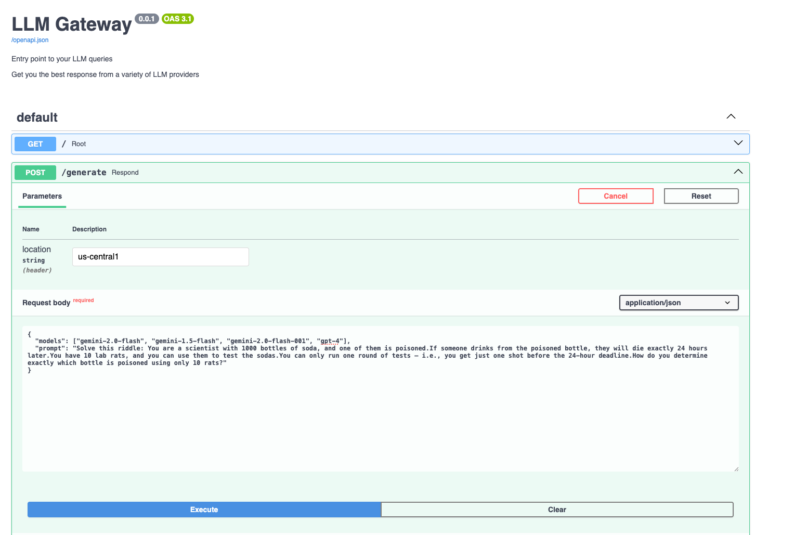
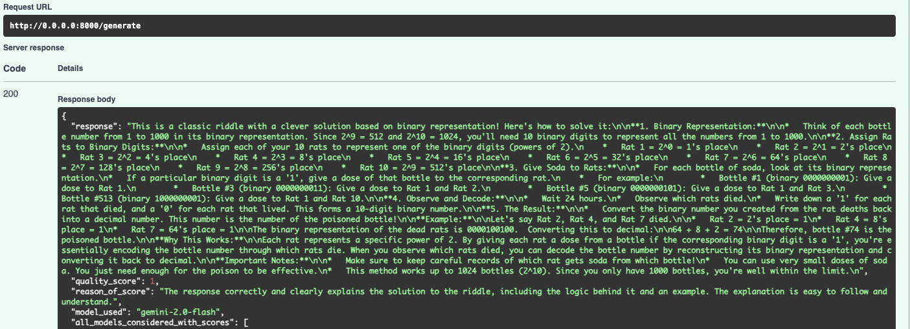

# LLM Gateway

**A FastAPI-based backend that routes queries to multiple Large Language Models, evaluates their responses, and returns the best one.**

FastAPI is a Python framework for building fast RESTful web services that support input/output data validation, asynchronous operations, and provide an easy-to-use web interface for testing endpoints through Swagger UI.

## API

<table>
  <tr>
    <td width="50%"></td>
    <td width="50%"></td>
  </tr>
</table>

## Installation

1.  **Clone the repository:**
    ```bash
    git clone git@github.com:bnarath/LLM_GATEWAY.git
    cd LLM_GATEWAY
    ```

2.  **Create and activate a virtual environment (recommended):**
    ```bash
    python -m venv env
    ```
    *   On Windows:
        ```bash
        .\env\Scripts\activate
        ```
    *   On macOS/Linux:
        ```bash
        source env/bin/activate
        ```
3.  **Install Poetry (if you don't have it already):**
    Follow the official instructions to install Poetry on your system: https://python-poetry.org/docs/#installation

4.  **Install project dependencies using Poetry:**
    This command will read the `pyproject.toml` file, resolve the dependencies, and install them into a virtual environment automatically managed by Poetry.
    ```bash
    poetry install
    ```

5.  **Activate the virtual environment (managed by Poetry):**
    To activate the virtual environment and use the installed dependencies, run:
    ```bash
    poetry shell
    ```
    
    Alternatively, you can run commands within the Poetry environment without explicitly activating the shell by prefixing them with `poetry run` (e.g., `poetry run uvicorn main:app --reload`).

6.  **Set up environment variables:**
     *   Create a `.env` file in the root of your project by copying the example file if you have one (e.g., `.env.example`).
     *   Add your necessary API keys and other configuration values to this `.env` file. For example:
     ```env
     OPENAI_API_KEY="YOUR_OPENAI_API_KEY"
     GOOGLE_GENAI_API_KEY="YOUR_GOOGLE_GENAI_API_KEY"
    HUGGINGFACE_TOKEN="YOUR_HUGGINGFACE_TOKEN"
    GOOGLE_GENAI_USE_VERTEXAI=true #TO USE VERTEX AI CREDENTIALS FOR GOOGLE GENAI
    VERTEXAI_PROJECT_ID="YOUR_VERTEX_AI_PROJECT_ID"
    ```

## Usage

### Running the FastAPI Server Locally

Once you have installed the dependencies and set up your environment variables, you can run the FastAPI server using Uvicorn.

If you have activated the Poetry shell (`poetry shell`):
```bash
uvicorn gateway.main:app --host 0.0.0.0 --port 8000 --reload #reload is used while developing the server not in production
```
Or, if you prefer not to activate the shell, you can use `poetry run`:
```bash
poetry run uvicorn gateway.main:app --host 0.0.0.0 --port 8000 --reload
```

The server will typically start on `http://0.0.0.0:8000`.

### Accessing the API Documentation (Swagger UI)

FastAPI automatically generates interactive API documentation. Once the server is running, you can access it in your browser:
*   **Swagger UI:** http://0.0.0.0:8000/docs
*   **ReDoc:** http://0.0.0.0:8000/redoc

This interface allows you to explore and test the API endpoints.